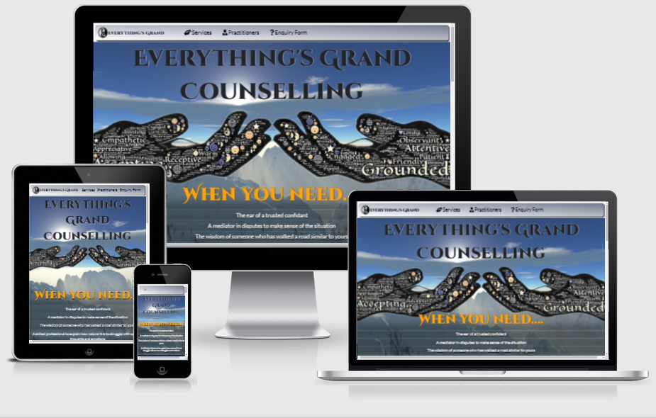

# **Everything's Grand Counselling**

## **Description** 

Everything's Grand Counselling is where people come when they need;

* The ear of a trusted confidant
* The wisdom of someone who has walked a road similar to yours 
* A skilled professional to explain how natural it is to struggle with our own thoughts and emotions
* A mediator in relationships to make sense of the situation

The site is laid out in a very simple easy to navigate structure with info on the practitioners and the  services offered

## **UX**

### **User Requirements and Expectations**

* Access to information on the types of councelling services offered
* A fully responsive and accessible site that functions fully on desktop, tablet and mobile
* An aesthetically pleasing site with relevant content
* Information on the practitioners and their expertise
* Contact details for practitioners are easy to find
* A form to query specific services and prices from practitioners

### **Owners Goals**

* Advertise services offered at a counselling practice
* Attract new clients to the practice
* Provide a means of enquiring about services offered

### **User Stories**

* As a user I want to immediately understand the purpose of the site
* As a user I want to be able to freely and easily navigate the site
* As a user I want to clearly see the services offered by the practice
* As a user I want to be able to query prices of these services
* As a user I want to be able to find information on the practitioners that offer these services
* As a user I want to easily find contact details of the practitioners
* As a user I want to read/see testimonials of previous/current clients
* As a user I want to find links to their social media so I can see their following

### **Design Choices**

#### Fonts

I searched through the google fonts library to find suitable fonts for the title and went for the [Cinzel Decorative](https://fonts.google.com/specimen/Cinzel+Decorative?preview.text=Everything%27s%20Grand&preview.text_type=custom&preview.size=29#standard-styles) font for the page title as it's easy to read and matches the text in the image.
I paired this font with the [Lato](https://fonts.google.com/specimen/Lato?preview.text=Everything%27s%20Grand&preview.text_type=custom&preview.size=29&query=lato) font as the two have a contrasting designs that complement each other nicely throughout the page.

#### Icons

I used Icons for the navbar and the footer links.
I used mainly fontawesomes icons but I also used a bootstrap icon for the hamburger drop down icon.

#### Colors

Using the [coolers](https://coolors.co/) colour pallette generator I found a colour scheme that I thought would suit the page. 
I went for contrasting shades of dark navy blue and light grey with a hint of bright orange to create an eye catching contrast.
Here is the Pallette I went for - [colour pallette](https://coolors.co/000000-14213d-fca311-e5e5e5-ffffff)

#### Structure

I structured my site to have three distinct sections.
The first is the hero image and animation which outlines what the sit is about.
The next section is the services section with the carousel which informs the user of the services provided by this practice.
The third section is the practitioners section which contains a card deck with images and information of the practitioners of the company.
I utilised bootstrap for most of the structure of the site as it has a mobile first approach which helps with responsiveness

## **Features**

#### Navigation

I utilised a bootstrap navbar for responsiveness. I also set a color gradient on the navbar to make it stand out a bit.
The nav items change to orange when hovered over. This is in line with the color theme and has a nice contrast with the light grey navbar.
I created the logo for the navbar on [logomakr.com](https://logomakr.com) and fixed the ratio by targeting the element with an id.
I used a Bootstrap modal for the enquiry form. I used the varying modal content template here as it had the email field and a text area for the users enquiry
Bootstrap Modal - https://getbootstrap.com/docs/5.0/components/modal/ 
I also utilised a custom shadow for the navbar from this site - [getcssscan.com](https://getcssscan.com/css-box-shadow-examples)

#### Hero Image

I decided on a hero image for the top of the site page and took inspiration from the love running animation of the hero image to create a subtle animation on the hero image each time the page opens. The hero image is symbolic and represents the goal of the practice which is to raise people out of their problems. 
The words within the hands are descriptive of the practice and the practitioners.
I used a free image editing tool called GIMP to remove the white background of the hero image so I could clear space for a dramatic background image.
Above the image we have the company title which informs the user of whos page they're on.
For the background image I went for a mountaintop skyline. The blue sky with the sun peaking through some hazy clouds is symbolic of bright days to come.

#### Services Section

In this section I decided to go for a dark background. I contrasted it with bright orange text to maintain accessibility.
The services card is a bootstrap card and again I utilised the custom shadows from getcssscan.com.
The main feature of this section is the carousel with the sliding cards with info on the services and relevant background images.
I used the bootstrap template [carousel](https://getbootstrap.com/docs/5.0/components/carousel/) on the bootstrap website 

#### Practitioners Section

The next section is the practitioners section where I utilised the bootstrap grid system to lay the cards out in two columns and rows above 1200px so the cards always had enough space for the information on the cards and the text wasn't too small.
In each of the cards there are testimonials which I marked with little light grey award icons to make them stand out and I also italicised the text to create more separation from the main text.

## **Testing**

### Navigation bar

* **Goals**    
I'm aiming to have the navbar on the top with links to each corresponding section across the navbar.
The links should bring you to where they say they're pointing to.
The navbar needs to be responsive and work on mobile phone screens.

* **Method**   
I employed a bootstrap navbar for responsiveness and because of the collapsible hamburger icon feature which makes it handy for mobile users.
I customised the navbar to fit in with the sites theme and added shadow and gradient to make it stand out.

* **Test**    
I tested all links, ensured the navbar collapsed correctly and the hamburger icon worked and all items worked on different screen sizes.

* **Results**    
All nav links work correctly and the navbar resizes correctly. The only issue is that on mobiles the enquiry form button is different to other links.

### Modal

* **Goals**    
The modal should open up when a user clicks on it and it should present two fields for email and an enquiry. 
When the user submits this form it should give feedback that it was submitted and close. 
Alternatively if the user clicks on the close button or the x at the top toclose the modal it should close.

* **Method**    
The modal I used is a bootstrap modal that I copied fronm the bootstrap site and customised it myself using css.
Unfortunately the feedback feature is beyond my current skills. I attempted to use popovers and tooltips but to no avail.

* **Test**    
Tested the modal on different screen sizes and different browsers to ensure all works correctly.

* **Resultss**    
The modal functions correctly on mobile devices and on different browsers. it opens up centrally and the background darkens.
Both buttons work correctly and the modal is dismissed when they are clicked.

### Carousel

* **Goals**    
The carousel should rotate through four slides and when the user clicks on the arrows either side they can change the current slide

* **Method**    
The carousel I chose was a bootstrap template and I chose it so it would be responsive and could be easily implemented.

* **Test**    
Tested the carousel on different screen sizes and browsers to ensure it ran smoothly and the buttons worked.

* **Results**    
The modal functions correctly on mobile devices and on different browsers. it opens up centrally and the background darkens.
Both buttons work correctly and the modal is dismissed when they are clicked.

### Bugs

* **Hamburger icon**

* Bug - When I began formatting the navbar, for some reason the hamburger icon disappeared.

* Fix - I utilised a bootstrap icon and inserted it in span element that had contained the original icon.
    this did the job perfectly

* **Navbar Icon**

* Bug - The icon in the navbar was stretched slightly because the aspect ratio was slightly off.

* Fix - I targeted the element with an id and set the width and height to fixed values to satisfy the aspect ratio

* **Practitioners Images**

* Bug - The photos weren't lining up within the cards correctly and made the cards all different sizes

* Fix - Resized the images in GIMP image editor to the correct aspect ratios so they would fit the cards correctly and line up.
    I also set all the card heights to 100 so they would be equal heights

## **Credits**

### **Media and Content**

For images I used a mixture of images from Pixabay and Unsplash

* [Unsplash](https://unsplash.com/) - Practitioner images
* [Pixabay](https://https://pixabay.com/) - Both hero images and the background images for the slides

### **Languages, Libraries, Frameworks and Tools**

* [HTML](https://en.wikipedia.org/wiki/HTML)
* [CSS](https://en.wikipedia.org/wiki/Cascading_Style_Sheets)

* [Font Awesome](https://fontawesome.com/)
* [Bootstrap](https://getbootstrap.com/)
* [Google Fonts](https://fonts.google.com/)
* [Bootstrap Icons](https://icons.getbootstrap.com/)

* [GIMP](https://www.gimp.org/)
* [logomakr.com](https://logomakr.com)
* [Coolers](https://coolors.co/)

## **Deployment**
I deployed this site using github pages. My mentor instructed me through the process.
The steps involved included:

1. Go to settings in the github repository and navigate to the pages section
1. Select branch master and save
1. The site is now live on **https://hjtb.github.io/everythings-grand/**
1. Commits and pushes are received by github and the page updates soon after

### **Running Locally**

Running the project locally can be done in a few short steps.

1. In the repo, click the clone or download button
1. Copy the link using the clone with https option
1. Open your development environment with the git terminal open and change working directry to the new repo location
1. Using the git clone command paste the URL you copied from earlier